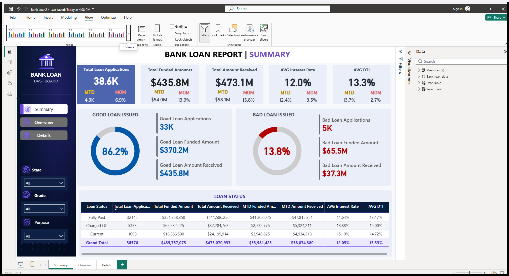

# Bank Loan Portfolio Analysis

Power BI and SQL project that analyzes loan applications, funding, repayments, portfolio quality, and borrower risk across 38,576 loan records.

## Dashboard preview

## Project overview

The report provides a three-page view of the lending portfolio: Summary, Overview, and Details. It combines executive KPIs, month-to-date comparisons, loan-quality segmentation, and drill-down analysis by state, grade, purpose, term, employment length, and home ownership.

## Key KPIs

| Metric | Result |
|---|---:|
| Loan applications | 38,576 |
| Total funded amount | $435.76M |
| Total amount received | $473.07M |
| Average interest rate | 12.05% |
| Average debt-to-income ratio | 13.33% |
| Good-loan share | 86.18% |
| Charged-off share | 13.82% |

## Key findings

- 33,243 applications were classified as good loans (Fully Paid or Current).
- 5,333 applications were charged off.
- Good loans accounted for approximately $370.2M in funded amount.
- Charged-off loans accounted for approximately $65.5M in funded amount.
- The report compares current month performance with the previous month for applications, funding, collections, interest rate, and DTI.

## Analysis coverage

- Total, month-to-date, and month-over-month KPIs
- Good-loan versus bad-loan segmentation
- Loan-status performance grid
- Funding and repayment analysis
- Interest-rate and DTI monitoring
- State, grade, purpose, term, employment, and home-ownership analysis

## Technology

- Power BI and DAX
- SQL Server and T-SQL
- Excel / CSV data preparation
- Custom Power BI JSON theme

## Repository guide

| File | Purpose |
|---|---|
| `Bank Loan.pbix` | Interactive Power BI report |
| `Bank Loan.sql` | KPI and period-comparison SQL queries |
| `financial_loan.csv` | Loan-level analysis dataset |
| `bank-loan-modern-theme.json` | Custom Power BI theme |
| `powerbi-ui-final.png` | Dashboard preview |

## How to explore

1. Open `Bank Loan.pbix` in Power BI Desktop.
2. Use the Summary page for portfolio health and high-level KPIs.
3. Use Overview for trends and segment comparisons.
4. Use Details for loan-level review.
5. Run `Bank Loan.sql` against a SQL Server table named `Bank_loan_data` to reproduce the core KPIs.

## Data note

The dataset is published for educational and portfolio analysis. Confirm the original source and redistribution terms before using it commercially.

## Author

[OmarRez2](https://github.com/OmarRez2)
